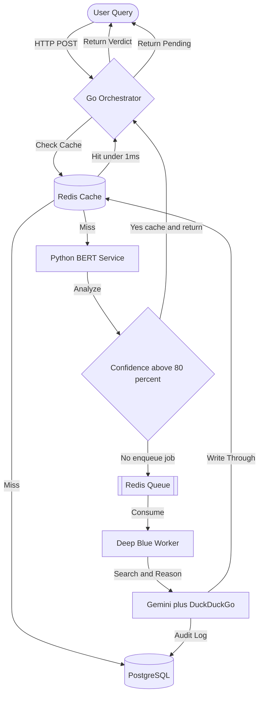

```mermaid
graph TD
    User([User Query]) -->|HTTP POST| Orch{Go Orchestrator}

    %% Tier 1 Cache
    Orch -->|Check Cache| Cache[(Redis Cache)]
    Cache -->|Hit under 1ms| Orch
    Orch -->|Return Verdict| User

    %% Tier 2 Scatter Gather
    Cache -->|Miss| DB[(PostgreSQL)]
    Cache -->|Miss| BERT[Python BERT Service]

    BERT -->|Analyze| Decision{Confidence above 80 percent}

    %% Fast Path
    Decision -->|Yes cache and return| Orch

    %% Slow Path Async
    Decision -->|No enqueue job| Queue[[Redis Queue]]
    Orch -->|Return Pending| User

    %% Tier 3 Deep Analysis
    Queue -->|Consume| Worker[Deep Blue Worker]
    Worker -->|Search and Reason| LLM[Gemini plus DuckDuckGo]
    LLM -->|Write Through| Cache
    LLM -->|Audit Log| DB

```
